# **DsCoin Client**

The client is a UI-based application that handles the following activities:

1. Creation and Submission of Transactions
2. Creation of Blocks
3. Mining and Submission of Blocks

These three can further be subdivided into many more sub-categories, such as: UTxO Viewing, CoinBase Addition, Blockchain Status, etc.\
The next few topics discuss how the client app works and how to use it correctly.

## 1. Logging In

This is the first dialog you will come across when launching the application. It is the entrypoint of the client workspace, and where you must either first add a wallet or select an already added one.

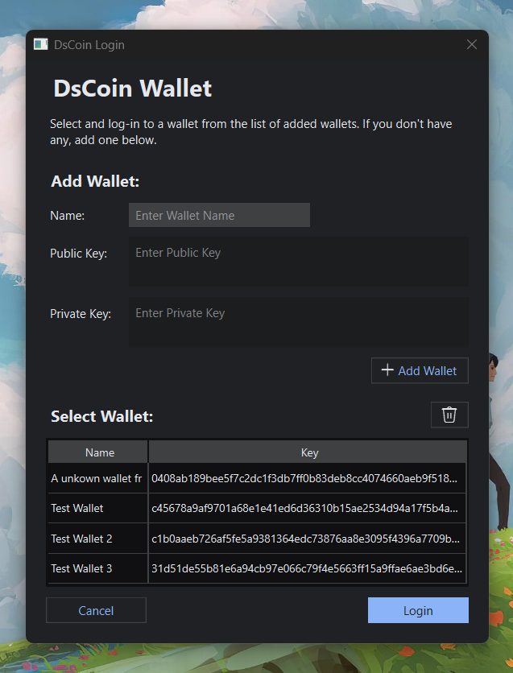

> ### How to Create a Wallet:
>
> You cannot create a wallet in the application. Instead you must generate one yourself using third-party applications.\
> A wallet is in essence is just a public/private key pair. You can generate a pair for yourself on free online sites. A good site I use myself is:\
> https://emn178.github.io/online-tools/ecdsa/key-generator/\
> Make sure you generate a **SECP256K1** Key in **Hex**. If you are confused as to what that is, it means that your key-pair must look something like this:
>
> ```
> Private Key:
> 4c847b1984be5e3339c9386fa026c596bb799c121dea73a30d6cb28fe44414c9
>
> Public Key:
> 04eeee76c4535c4c48f64c5c6cf7811ddb67c4b6dbee22d3b313f124deea127339a212a791ca1ac11dfe00b26b9edac53fb43c6c4d28bbecc3460a676f510428ba
> ```
>
> _Remember, the public key is always longer than the private key._\
> The public key generated is now _your_ identity in the coin world. Any payments made will be made to this sequence of characters. The private key, on the other hand, is the password that gives you access to use the public key. Always keep this key safe, secure and, most importantly, hidden from others. Since everyone already knows your public key (hence the name), all that stands between your wallet and the world is your private key.

Once you have a wallet to add, you can fill the details into the fields and click on add wallet.

> Naming your wallets is optional, but it is best practice to do so as it soon becomes very difficult to differentiate between multiple wallets based on their key sequences.

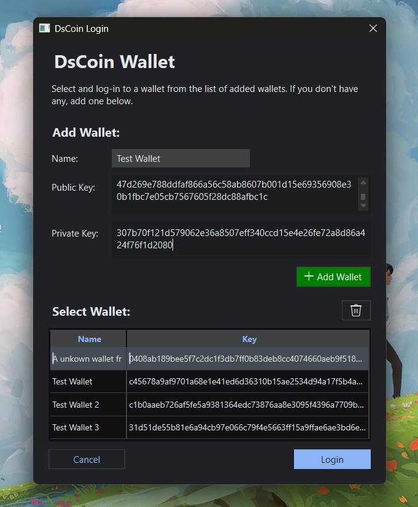

Once you've added a wallet, you can click on it in the wallets list to select it, and login using the login button.

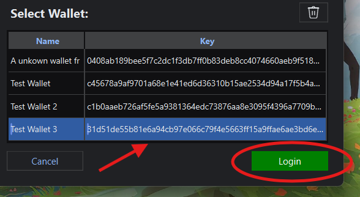

## 2. My Wallet

The first thing you see after logging in to your wallet is the My Wallet tab. This is where you create transactions and view your UTxOs.

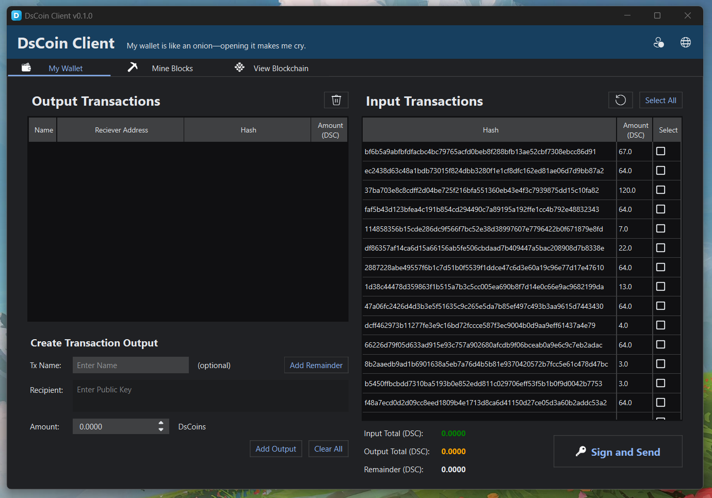

The UI may seem daunting at first but there are just four main elements that you need to understand to use your wallet:

1. **Output Transactions:** The list of all transactions you make out (send coins to others)
2. **Input Transactions:** The list of all transactions that were made out to you, and you haven't spent (UTxOs)
3. **Create Transaction Output:** The form where you fill out the output details
4. **Transaction Data:** The totals of your outputs, inputs and their remainder

> ### How Transactions work:
>
> Transactions in crypto work a little bit differently than in traditional banking systems. Instead of a balance that exists as a number under your account name, in crypto there are **Unspent Transaction Outputs** (UTxO).\
> Anytime someone pays somebody else, they create an output (think of it as them outputting coins). That output exists on the blockchain as an _Unspent Transaction Output_. This means that the person who recieved those coins in the output, can use this output to pay others.\
> They can do that by adding this UTxO as an 'input' to their own transaction. After that, they can create new outputs to other people, using these inputs as a backing.\
> Once they've used an UTxO as an input, they can never use it again, and it becomes 'spent'. Here's a quick example:
>
> ```
> Mei's Transaction:
>   Inputs:
>       1. Some UTxO (Assume)
>   Outputs:
>       1. Pay Chen, 20 DsC
> ```
>
> Chen now has one UTxO to his name (you can say he has 20 DsC to his name). He can now use it to pay someone else by using it as an input:
>
> ```
> Chen's Transaction:
>   Inputs:
>       1. Mei's Transaction, Output no. 1, 20 DsC (the UTxO)
>   Outputs:
>       1. Pay for Lobotomy, 20 DsC
> ```
>
> Chen can not use the UTxO again now. He can also never output a higher amount than his input.\
> Additionally, Chen can also add multiple inputs from different senders to create a larger output:
>
> ```
> Chen's Transaction (redo):
>   Inputs:
>       1. Mei's Transaction, Output no. 1, 20 DsC
>       2. Dad's Transaction, Output no. 3, 20 DsC (Assume)
>       3. Mom's Transaction, Output no. 2, 80 dSc (Assume)
>   Outputs:
>       1. Pay for Better Lobotomy, 120 DsC
> ```
>
> If Chen outputs less than his inputs total to, the remainder gets paid to Block Miners as fees (more on this later). If his inputs don't amount exactly to his outputs, he can add an output to himself for that amount.
>
> ```
> Chen's Transaction (redo 2):
>   Inputs:
>       1. Mei's Transaction, Output no. 1, 20 DsC
>       2. Dad's Transaction, Output no. 3, 20 DsC (Assume)
>       3. Mom's Transaction, Output no. 2, 80 dSc (Assume)
>   Outputs:
>       1. Pay Lobotomy Cancellation Fees, 110 DsC
>       2. Pay Chen, 10 DsC (remainder)
> ```
>
> To create a transaction, you must create your outputs. This is where you specify who you wish to pay, and how much. You may add as many outputs to as many people as you wish, but you must have sufficient inputs to back them up.\
> Enter the details of your output in the form to create an output:

1. Recipient's address (their public key)
2. Amount (in DsC)
3. Output name (optional, but best practice)

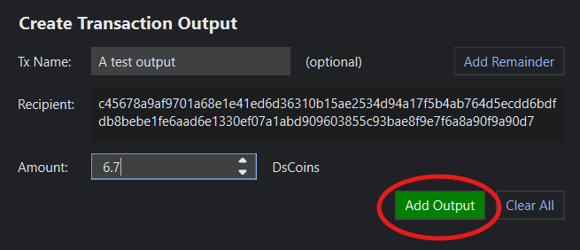

You can now view your output in the outputs list.

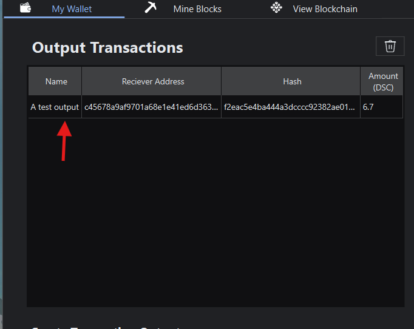

Next, you must add the necessary inputs to back your outputs. First refresh the inputs list to get your latest UTxOs:

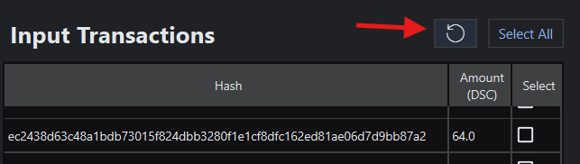

> **IMPORTANT:** You must be connected to a node in order to load your latest UTxOs.

Next, select the checkbox on the UTxOs you want to select. You can use the Select All button to select all UTxOs if you don't have that many (if you're broke).\
You can also see the total of all selected UTxOs below the list.

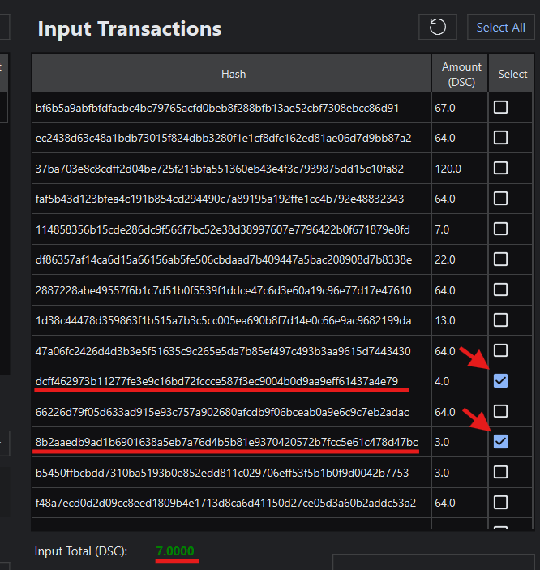

The Transaction data below shows you the totals of your outputs and inputs. It also shows the remainder. If remainder is negative, you must add more inputs, or your transaction is invalid.

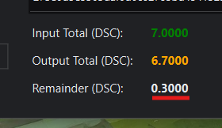

If you wish to pay off the remainder as fees to the miner, you may submit the transaction as is. However, if you want your money back, you can click on the Add Remainder button to create an output that pays yourself the amount.

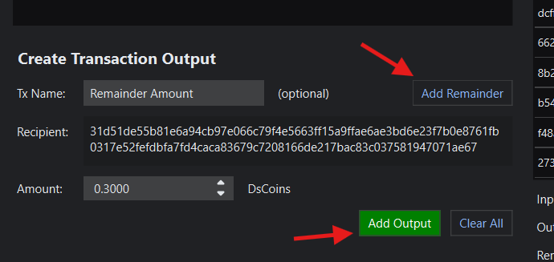

Once everything is confirmed, you can finally sign and submit the transaction to the blockchain by clicking on the Submit button.

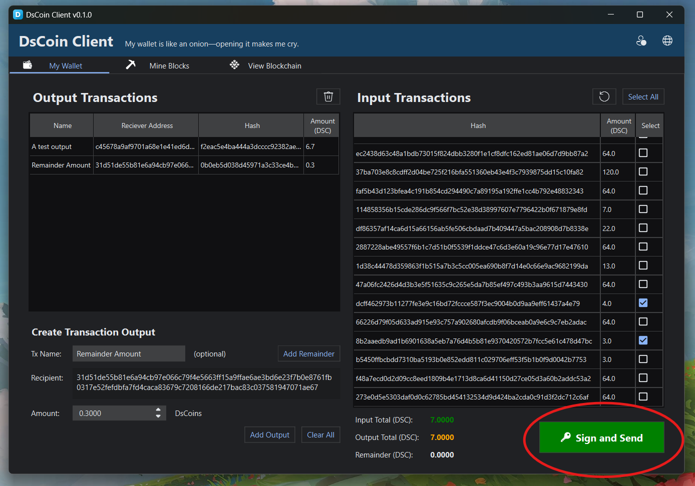

> **IMPORTANT:** You must be connected to a node to submit transactions.

---

---

# **Behind the Scenes**

This is how the coin works behind the scenes, from transaction handling to block mining and blockchain management. You can use the modules mentioned below to test it out for yourself.\
The transactions and blocks module exists in the common\ directory, and the blockchain module itself lives in the node\ directory.

## Naming Convention:

Public Key = **pk**\
Private Key = **sk**\
\
Sender = **sndr**\
Reciever = **rcvr**\
Amount = **amt**\
\
Transaction: **Tx**\
Transaction Input: **TxI**\
Transaction Output: **TxO**\
\
Unspent Transaction: **UTxO**\
Coin Base Transaction: **CBTx** _(sometimes **CBTxO**)_

Block Hash = **blockh**

## 0. Hashes & Hash Info

> Knowing about hashes and hash infos is a prerequisite to understanding how hashes are used in this project. This is a brief overview of that

> ### Hashes
>
> Hashes are the strings generated by the SHA256 algorithm from another string of data that was passed to it. The usefulness of hashes comes from the fact that every unique string has a unique hash, i.e. no two different strings can have the same hash.\
> Hashes cannot be reconstructed back into the orignal string that was used. This ensures anonymity and privacy when these hashes are passed around as a means of representing an unique object, all without revealing what its unique features are.\
> In summary, every object can theoretically have its own unique hash that depends on its contents, but the contents can never be ascertained using the hash. One can determine if the object has been tampered with (if its hash changes) all without knowing what exactly changed and how.

> ### Hash Info
>
> Understanding hashes raises the question: How do we use hashing algorithms such as SHA256, for python objects?\
> The answer is to take all the unique, identifying attributes and data the object posseses and wrap it all neatly inside a formatted string. This string will then get passed to the hashing function and it is called the object's _Hash Info_. \
> Every attribute or child object, no matter its type, can be associated with its unique representation in string form, and be integrated into the Hash Info string. My modules use Hash Info functions extensively to generate unique strings that are fingerprints of the objects passed, before ultimately hashing those strings for privacy.

> ### Example of a Hash Info
>
> This is what the Hash Info function of a TxO returns on calling.\
> As can be seen, it integrates all the uniquely identifying features of the TxO, such as its nonce, sender, reciever, and amount, into a formatted string that can then be hashed to hide this sensitive information.
>
> ```py
> return f"nonce: {TxO.nonce}||sndr: {TxO.sndr.to_string().hex()}||rcvr: {TxO.rcvr.to_string().hex()}||amt: {TxO.amt} DSC"
> ```
>
> Hashing this then yields a hash string, which for example's sake can be assumed to be the following:\
> `0d1cb9f83863a5d7e8c5fce2e121f3ea953059976dc1bc47b48df53d05b6d6e4`\
> Even a small change in any protected value, for example a change of 0.1 DsCoins in the amount, will now yield a completely different hash:\
> `3dd07561391db635561ba2c30030f79de8d0e36bd2458db2361e5379b859bb17`\
> Hence it becomes apparent to any third-party observer that the TxO was tampered with, without knowing what exactly was changed.

> ### Malicious Objects
>
> Sometimes blocks or blockchains may recieve transactions that display a valid hash and are signed (the hash is signed usually, implying that the hashed info beneath is authorized), but actually hold different attributes internally.\
> These are malicious objects that impersonate the real class objects and lie about their hash and signature.\
> As an example, a Tx may display a valid hash signed by Fang, but contain attributes declaring a payment from Lianhua to Haoyun, all without Lianhua's consent.If just a simple hash existence check, and signature verification were implemented, such a malicious transaction would pass.\
> Therefore, it is imperative that an independent (not under the control of the object) and incorruptible (not able to be manipulated by external inputs) function is created to read all the attributes of the object, compile its hash info, hash that info, and finally compare it with the hash the object claims.

## 1. Transactions

## CLASS: **TxO**( _sndr, rcvr, amt_ )

> Fundamental unit of a Tx. It can be automatically created within a Tx by using the _.create_output()_ method.

### Parameters:

1. **sndr**: Public key of the user sending the amount
2. **rcvr**: Public key of the user recieving the amount
3. **amt**: The total amount being transferred (in DsCoins)
4. **name** _(optional)_: Name of the output _(default: "unnamed_output")_

### Methods:

None

### Initialization & Usage:

```py
    from transactions import TxO
    import ecdsa

    #Generate Private Keys
    sk1 = ecdsa.SigningKey.generate(ecdsa.curves.SECP256k1)
    sk2 = ecdsa.SigningKey.generate(ecdsa.curves.SECP256k1)
    #Generate Public Keys
    pk1 = sk1.get_verifying_key()
    pk2 = sk2.get_verifying_key()

    #Create the TxO (pk1 pays pk2 64 DsCoins)
    pk1_pk2_64 = TxO(pk1, pk2, 64)
```

## CLASS: **Tx**( _sndr_ )

> The Tx itself that contains all the Inputs and Outputs (+ a Tx fee)

### Parameters:

1. **sndr**: Public key of the user initiating the Tx
2. **name** _(optional)_: Name of the Tx _(default: "unnamed_tx")_

### Methods:

1. **.add_input( TxO )**: Adds an UTxO _(an output made to the initiator in previous confirmed Tx's)_
2. **.create_output( rcvr, amt )**: Creates a TxO with the initiator as the sender and **rcvr** as recipient, with an amount equal to **amt**.
3. **.sign( sk )**: Signs the Tx using a Private Key **sk**.

### Initialization & Usage:

```py
    #---Continuation of previous code block---
    from transactions import Tx

    #Create a Tx in pk2's name
    tx = Tx(pk2)

    #Add the output made out to pk2 earlier as an input
    tx.add_input(pk1_pk2_64)

    #pk2 may now use this input to justify an output to pk1
    #Create an output made out to pk1 for an amount of 32 DsCoins
    tx.create_output(pk1, 32)

    #Sign the Tx with pk2's private key sk2
    tx.sign(sk2)
```

> As you may have noticed, the inputs and outputs are unbalanced (a remainder of 32 DsCoins remains). We will approach this in the blocks module demo by the addition of Tx fees.

## FUNCTION: verify_tx(Tx)

> A general Tx verification tool that is trusted/utilised by both the host block and the blockchain. It verifies the following properties of the the Tx:

**1. Hash Honesty:** Whether the Tx, and all the TxOs contained within, are presenting the correct hash in their 'hash' attribute, or if they are malicious objects, impersonating those classes and lying about their true hash identity. This prevents Tx, TxO class impersonators from hiding unauthorized data behind false hashes.

**2. Equilibrium:** Whether or not the inputs and outputs of the Tx are balanced (after accounting for any Tx fees), i.e. inputs = outputs + fees

**3. Signature:** Whether the initiator of the Tx (pk) is the signee of its contents, or if someone else has signed it.

# 2. Blocks

## CLASS: **CBTx**( _rcvr, amt_ )

> A coin base Tx is a transaction that is signed by no-one but is authorized by the chain to add new coins, pay transaction fees, and pay the rewards for mining a block.

### Parameters:

1. **rcvr**: Public key of the user recieving the amount
2. **amt**: The total amount being transferred (in DsCoins)
3. **type**: Type of CBTx _(addition **(default)**, reward, fee)_
4. **name** _(optional)_: Name of the CBTx _(default: "unnamed_cbtx")_

### Methods: None

### Initialization & Usage

```py
    #---Continuation of previous code block---
    from blocks import CBTx

    #Create a CBTx paid to pk2 in form of an addition of 16 new coins
    cbtx = CBTx(pk2, 16, type="addition")
```

> Addition is the only type of CBTx created manually. Other types of CBTx's (such as fees and rewards), are handled by the blocks.

## CLASS: **Block**( _previous_hash, miner_pk_ )

> The block class handles the hosting/storing of Tx's, calculation of fees in the event of unequilibrium between outputs and inputs, and the mining of the block's contents to obtain an acceptable hash.

### Parameters:

1. **previous_hash**: The hash of the block that this block will append to in the chain.
2. **miner_pk**: Public key of the individual mining the block. Mining rewards and transaction fees will be created for this key.
3. **miner_reward**: The reward amount that the block will add to itself in the miner's name _(default: 64)_
4. **Tx_limit**: The amount of Tx's a block may add to itself _(default: 5)_
5. **difficulty**: The difficulty of the hash that is to be obtained through mining. It corresponds to the number of zeroes the block's hash must lead with _(default: 3)_
6. **name** _(optional)_: Name of the block _(default: "unnamed_block")_

### Methods:

1. **.add_Tx( Tx )**: Adds a Tx to the block. Returns **True** if it is accepted and **False** otherwise.
2. **.add_CBTx( CBTx )**: Adds a CBTx to the block. Returns **True** if it is accepted and **False** otherwise.
3. **.isMined()**: Returns **True** or **False** depending on whether or not the block is mined, i.e. the block hash meets the difficulty criteria.
4. **.mine()**: Mines the block as per the set difficulty level, returning the mined hash on completion. Also adds a CBTx in name of the miner as the mining reward.

> ### How are blocks are mined
>
> The block contains an attribute known as the mine sequence _(mine_seq)_, which is a part of the block's hash info. This sequence is incremented by one and hash of the block is computed. \
> If the hash is acceptable, the block is considered mined, otherwise the sequence is incremented and the cycle repeats.\
> Depending on the difficulty, the sequences can sometimes take very long times to determine.

### Initialization & Usage:

```py
    #---Continuation of previous code block---
    from transactions import Block

    #Create a block with no previous and pk1 as the miner
    b1 = Block(None, pk1, name="b1")

    #Add the Tx we created to the block
    b1.add_Tx(tx)
    #The block will automatically calculate the difference between the inputs and outputs as being 32 DsCoins and add that as a transaction fee to pk1

    #Mine the block
    b1_hash = b1.mine() #Returns the final block hash
    print(b1_hash)
```

> Behind the scenes, pk1 obtains 64 DsCoins as miner reward and a futher 32 DsCoins as fee from the remainder of the Tx.

## FUNCTION: verify_block( block, difficulty, miner_reward )

> A general block verification tool that is trusted/utilised by the blockchain. It verifies the following properties of the the block:

**1. Hash Honesty:** Whether the block, and all its child objects are presenting the correct hash in their 'hash' attribute, or if they are malicious objects, impersonating those classes and lying about their true hash identity. This prevents impersonators from hiding unauthorized data behind false hashes.

**2. Effort:** Whether or not the block put in the necessary effort to obtain an acceptable hash that follows the difficulty specified (passed to the function as a parameter).

**3. Authorized Rewarding:** Whether or not the CBTx's in the block that are labelled as rewards do not exceed the miner reward specified (passed to the function as a parameter).

> In addition the above, the function also calls the _verify_Tx()_ method on every Tx in the block to verify them.

# To-do list:

1- Add CoinBase maturity: miner rewards can only be used after 10 blocks or more are appended to that block

2- Add auto snapshot at every n blocks feature

3- Create user client, integrate transaction creation into UI, and implement client UTxO fetching

4- Create a miner client with block mining UI, and implement local mempool

5- Display copy of blockchain through a visual GUI in clients

6- Create node client with mempool and blockchain copy.

7- Connect user clients, miner clients with nodes: node mempool updates local miner mempools, node blockchain updates clients' copies

8- Create a chain verification tool that scans and verifies entire specified segment of chain.
